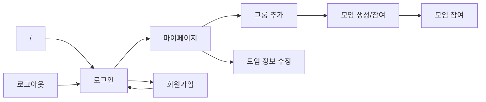

# SKKULIFE
```
pip install requirements.txt
python ./app.py
```

## Credentials
- **홍길동**  
example1<span></span>@example.com / 1234
- **aVerySuperDuperLongUsername**  
example2<span></span>@example.com / 1234

## Flow


## Tasks
- [x] 로그인
- [ ] 비밀번호 찾기
- [ ] 이메일/비밀번호 불일치
- [x] 회원가입 (Dummy)
- [x] 마이페이지
- [x] 모임 생성/참여 선택 화면 (모임 가입 전)
- [ ] 모임 생성 화면
- [x] 모임 참여 화면 (모임 참여 코드 입력)
- [x] 모임 정보 수정 화면 (모임 관리)
- [ ] 모임별 메인 화면 (모임 메인)
- [ ] 모임 멤버 정보 (모임 메인 멤버)
- [ ] 모임 인증/마감 화면
- [ ] 모임 게시글
- [ ] 모임 벌칙 화면
- [x] 상단 배너 (SKKULIFE)
- [x] 유저 프로필 아이콘 (메뉴 버튼)
- [ ] React Interop