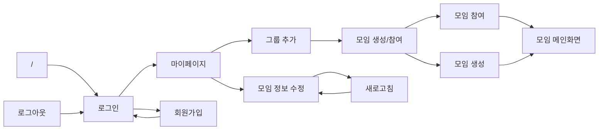

## Flow

## Tasks
- [x] 로그인
- [ ] ~~비밀번호 찾기~~
- [X] 이메일/비밀번호 불일치
- [x] 회원가입
- [x] 마이페이지 (계정 메인)
- [x] 모임 생성/참여 선택 화면
- [X] *모임 생성 화면*
- [x] 모임 참여
- [x] 모임 정보 열람
- [X] *모임 수정*
- [x] 상단 배너 (SKKULIFE)
- [x] *유저 프로필 아이콘 (메뉴 버튼)*